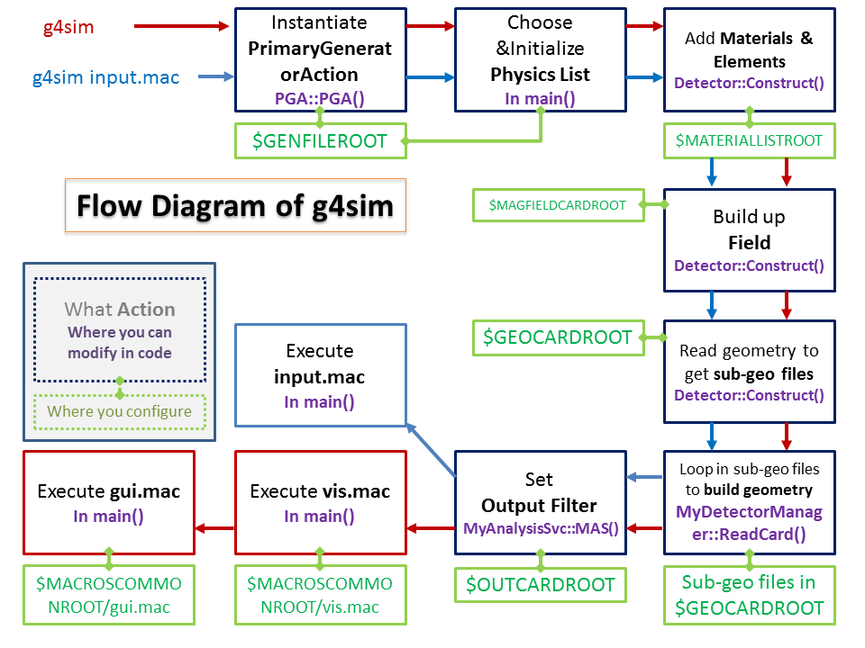

g4sim
=====

Simulation toolkit based on Geant4 and ROOT 

###1. Installation
#####Prerequirements:  
1.	CMake installed

	If CMake if not provided by your package manager, you can visit [CMake](http://www.cmake.org/) for source code then install CMake in this way:

		cd CMake
		./bootstrap
		./configure --prefix=path/to/CMake
		make
		make install
	
2.	Geant4 installed  
	[Geant4](http://geant4.cern.ch/)  
	If you want a UI with QT & OpenGL, please configure while installation.
	You can follow this way:

		cmake -DCMAKE_INSTALL_PREFIX=path/to/Geant4\
			  -DGEANT4_INSTALL_DATA=ON\
			  -DGEANT4_USE_GDML=ON\
			  -DGEANT4_USE_G3TOG4=ON\
			  -DGEANT4_USE_QT=ON\
			  -DGEANT4_USE_OPENGL_X11=ON\
			  -DGEANT4_USE_RAYTRACER_X11=ON\
			  -DGEANT4_INSTALL_EXAMPLES=ON\
			  -DGEANT4_USE_SYSTEM_CLHEP=ON\
	      		  path/to/Geant4-source
		make
		make install
	      
	CLHEP and XERCES are required by Geant4. If they are not installed in standard directories, please specify:

			  -DCLHEP_ROOT_DIR=path/to/CLHEP -DXERCESC_ROOT_DIR=path/to/XERCES
	      		  
3.	ROOT installed  
	[ROOT](http://root.cern.ch/drupal/)  
	You can install ROOT in this way:

		cd root
		./configure --enable-opengl\
		          --enable-soversion\
		          --enable-mathcore\
		          --enable-mathmore\
		          --enable-gdml\
		          --enable-python\
		          --enable-roofit\
		          --enable-minuit2
		make
		
	If you met an error saying mathmore is not installed, a possible reason can be that GSL is not installed in a standard directory. You can configure with:

		--with-gsl-incdir=path/to/GSL/include --with-gsl-libdir=path/to/GSL/lib

#####Install:

	$ cd cmake
	$ cmake .
	$ make
	
###2. How to use
#####Prerequirements:  
	
1. 	Geant4 environment is set already.

	If not, then  
`source /path/to/geant4/bin/geant4.sh`  
`source /path/to/geant4/share/Geant4-*/geant4make/geant4make.sh`
	
2.	ROOT environment is set already.

	If not, then  
`source /path/to/root/bin/thisroot.sh`

3.	Your work directory has been created.

	Now we have `alcap` and `Example` sitting there

4.	g4sim basic environment is set already.

	If not, go to your work directory and  
`source env.sh`

#####To start:  

	$ cd alcap # or whatever working directory
	$ source setenv.sh
	$ g4sim [macros/run.mac]           # Choose any Geant4 macro file you want.
	                                   # without macro file it would enter interactive mode.
	                                   
#####To explain:  

	A figure to show how it works:  
	  
